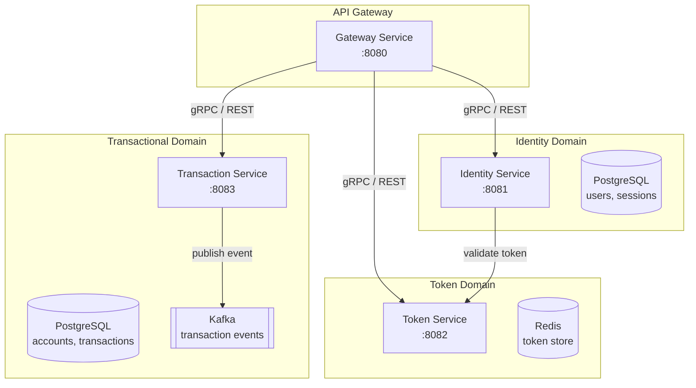
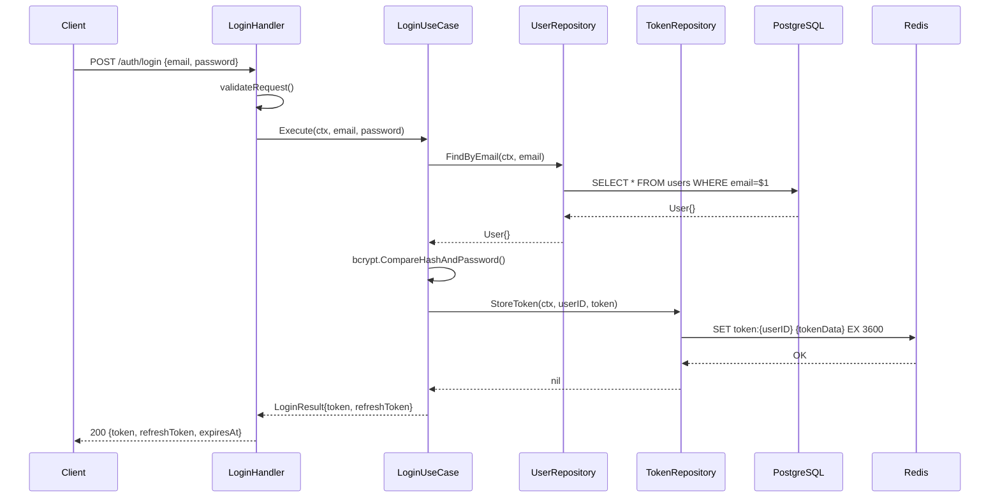

# Go Microservice — Deep Codebase Understanding Workflow

## Output Format

All output from this workflow MUST be in Markdown format including:
- Mermaid diagrams for visual flow
- Clear and structured sections
- Code snippets as references, not full reproductions

## Phase 1 — Service Boundary Mapping

Create a boundary map for each service. Output:



*The above template is an example — AI must generate based on actual code read.*

## Phase 2 — Entry Point Analysis

For each service, identify:

```markdown
## [Service Name] Entry Points

### HTTP Endpoints
| Method | Path | Handler | Middleware |
|--------|------|---------|------------|
| POST | /auth/login | LoginHandler | RateLimiter, RequestLogger |
| POST | /auth/refresh | RefreshTokenHandler | RateLimiter |

### gRPC Methods (if any)
| Service | Method | Request | Response |
|---------|--------|---------|----------|
| AuthService | ValidateToken | ValidateTokenReq | ValidateTokenResp |

### Message Consumer (if any)
| Topic/Queue | Handler | Consumer Group |
|-------------|---------|----------------|
| transaction.created | TransactionCreatedHandler | notification-group |
```

## Phase 3 — Function Call Graph (Deep-Dive)

Trace from entry point to database. Output Mermaid:



## Phase 4 — Data Flow per Transaction

For financial transaction flows, create a more detailed diagram:

```mermaid
flowchart TD
    START([Client Request\nPOST /transfer]) --> AUTH{Auth\nMiddleware}
    AUTH -->|token invalid| ERR401[401 Unauthorized]
    AUTH -->|token valid| VALIDATE[ValidateTransferRequest\n- amount > 0\n- destination account exists\n- not same account]

    VALIDATE -->|invalid| ERR400[400 Bad Request]
    VALIDATE -->|valid| IDEMPOTENCY{Check\nIdempotency Key\nin Redis}

    IDEMPOTENCY -->|duplicate request| ERR409[409 Conflict\nDuplicate Transaction]
    IDEMPOTENCY -->|new request| LOCK[Acquire Distributed Lock\nRedis SETNX\ntx:{sourceAccountID}]

    LOCK -->|lock failed| ERR423[423 Locked\nAccount Busy]
    LOCK -->|lock acquired| BEGIN_TX[BEGIN TRANSACTION\nIsolation: SERIALIZABLE]

    BEGIN_TX --> CHECK_BAL[SELECT balance\nFOR UPDATE NOWAIT\nfrom accounts]
    CHECK_BAL -->|insufficient| ROLLBACK1[ROLLBACK\nRelease Lock]
    ROLLBACK1 --> ERR402[402 Insufficient Balance]

    CHECK_BAL -->|sufficient| DEBIT[UPDATE accounts\nSET balance = balance - amount\nWHERE id = sourceID]
    DEBIT --> CREDIT[UPDATE accounts\nSET balance = balance + amount\nWHERE id = destID]
    CREDIT --> INSERT_TX[INSERT INTO transactions\nstatus = COMPLETED]
    INSERT_TX --> COMMIT[COMMIT]
    COMMIT --> RELEASE[Release Distributed Lock]
    RELEASE --> PUBLISH[Publish Event\ntransaction.completed\nto Kafka]
    PUBLISH --> RESP200[200 OK\nTransactionResult]
```

## Phase 5 — Dependency & Package Map

```markdown
## Internal Package Dependencies

```
service/
├── cmd/            → main.go (entry point, DI wiring)
├── internal/
│   ├── handler/    → depends on: usecase
│   ├── usecase/    → depends on: repository, domain
│   ├── repository/ → depends on: domain, infrastructure
│   ├── domain/     → NO dependencies (pure business objects)
│   └── middleware/ → depends on: usecase (auth)
├── pkg/            → shared utilities (no business logic)
└── infrastructure/ → DB, Redis, Kafka client setup
```

Dependency rule: handler → usecase → repository → domain
NEVER: domain → repository, usecase → handler
```

## Phase 6 — Struct & Interface Map

```markdown
## Core Interfaces

### UserRepository
```go
type UserRepository interface {
    FindByEmail(ctx context.Context, email string) (*domain.User, error)
    FindByID(ctx context.Context, id uuid.UUID) (*domain.User, error)
    Create(ctx context.Context, user *domain.User) error
    UpdatePassword(ctx context.Context, id uuid.UUID, hashedPw string) error
}
```

### Implementation: PostgresUserRepository
- File: `internal/repository/postgres/user_repository.go`
- DB: PostgreSQL via `sqlx`
- Table: `users`
```

## Complete Output Format

When this workflow is executed, the AI must produce a Markdown document with the following structure:

```markdown
# [Service Name] — Codebase Deep Dive
Generated by Mobius understand-codebase workflow

## 1. Service Overview
## 2. Architecture & Boundaries [Mermaid: graph]
## 3. Entry Points [table]
## 4. Function Call Graph — [Endpoint Name] [Mermaid: sequenceDiagram]
## 5. Data Flow — [Feature Name] [Mermaid: flowchart]
## 6. Package & Dependency Map
## 7. Core Interfaces & Structs
## 8. Configuration & Environment Variables [table]
## 9. Known Complexity Points [list — areas requiring extra attention]
```

Save output to: `.mobius/docs/[service-name]-deep-dive-[YYYY-MM].md`
